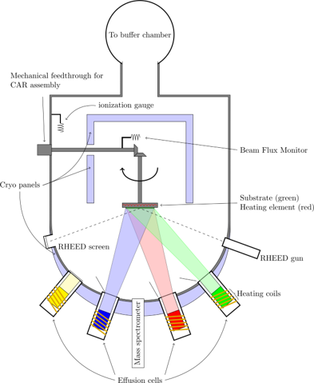
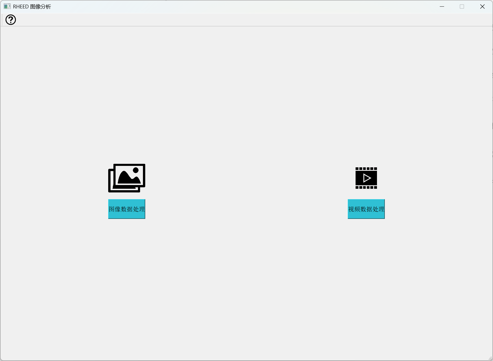
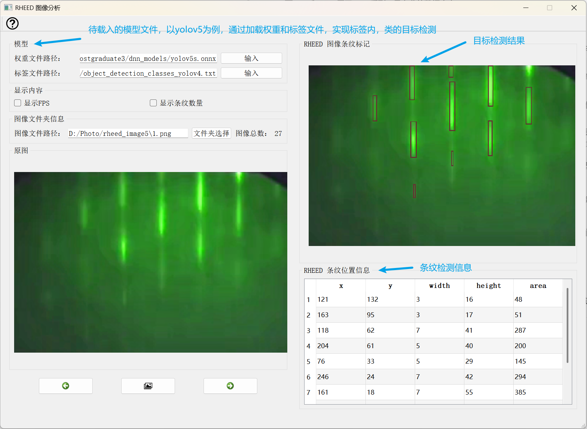
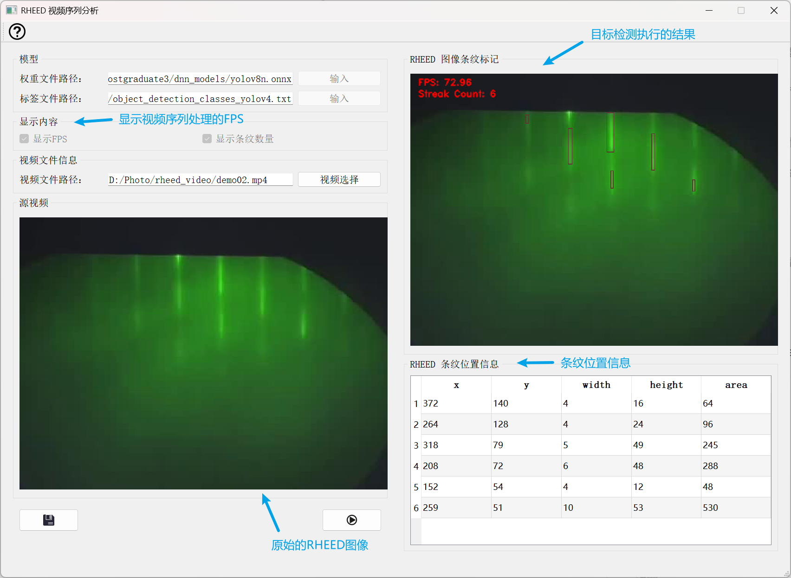

# RHEED图像分析方法研究

本研究尝试寻找一种多任务的学习方法，分析RHEED图像，优化RHEED在MBE工艺的监控能力。

  

## 一、RHEED图像分析软件 UI 部分

### 1.1 用到相关 QT 的一些机制

> - 各种小组件
>
>   - 标签、按钮、交互框、表格、布局管理器等
>
>   - 菜单栏、工具栏、标签栏
>
> - 信号与槽机制
>   - 处理各种响应事件
>
> - 多线程机制
>
>   - 主线程负责 UI 显示
>
>   - 子线程负责 RHEED 图像 & 视频处理 

### 1.2 软件设计模式

> - MVVM 设计模式
>
>   - Model：数据 & 业务逻辑
>
>   - View：UI 界面
>
>   - View Model：关于如何将 Model 的内容搬运到 UI 中
>
> - 优点 & 必要性
>
>   - 解耦合
>
>   - 高效率
>
>   - 可测试
>
>   - 可维护性

### 1.3 效果

软件需要支持训练好的多任务模型导入，这很重要。

#### 1.3.1 主界面

  

#### 1.3.2 RHEED图像分析部分

  

#### 1.3.1 RHEED视频序列分析部分

  

## 二、多任务深度学习模型算法研究